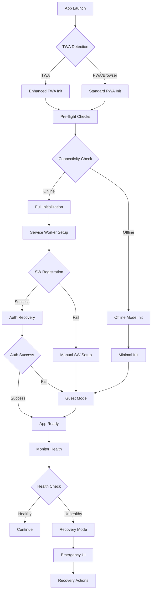

# Design Document

## Overview

The VibeTales app loading failures on new Play Store installations stem from multiple interconnected issues in the TWA (Trusted Web Activity) initialization, service worker registration, authentication persistence, and cache management systems. The design addresses these issues through a multi-layered approach that includes enhanced error detection, progressive loading strategies, robust cache management, and comprehensive recovery mechanisms.

## Architecture

### Core Problem Analysis

Based on codebase investigation, the primary failure points are:

1. **TWA Container Initialization**: The Capacitor configuration points to a remote server URL (`https://vibetales.bestselfs.com`) which may cause issues if the TWA container cannot properly establish the connection on first launch
2. **Service Worker Registration**: Complex PWA service worker with aggressive caching may conflict with fresh installations
3. **Authentication State Recovery**: Supabase authentication initialization may fail silently on new devices
4. **Cache Version Conflicts**: Multiple cache-busting mechanisms may create conflicts during first load
5. **Emergency Recovery Timing**: Current 10-second timeout may be too long for users experiencing immediate failures

### Solution Architecture



## Components and Interfaces

### 1. Enhanced Startup Orchestrator

**Purpose**: Coordinates the entire app initialization process with comprehensive error handling

**Key Features**:
- Progressive loading with fallback strategies
- Real-time health monitoring
- Automatic recovery triggers
- Detailed diagnostic logging

**Interface**:
```typescript
interface StartupOrchestrator {
  initialize(): Promise<StartupResult>;
  getHealthStatus(): HealthStatus;
  triggerRecovery(reason: RecoveryReason): Promise<void>;
  exportDiagnostics(): DiagnosticReport;
}

interface StartupResult {
  success: boolean;
  mode: 'full' | 'limited' | 'offline' | 'recovery';
  errors?: StartupError[];
  timing: PerformanceMetrics;
}
```

### 2. TWA Environment Detector

**Purpose**: Accurately detect TWA environment and configure appropriate initialization strategies

**Enhanced Detection Logic**:
- Multiple detection methods with fallbacks
- Play Store referrer validation
- Android WebView capability testing
- Capacitor bridge health checks

**Interface**:
```typescript
interface TWADetector {
  detectEnvironment(): TWAEnvironment;
  validatePlayStoreOrigin(): boolean;
  testWebViewCapabilities(): WebViewCapabilities;
  getCapacitorStatus(): CapacitorStatus;
}
```

### 3. Progressive Service Worker Manager

**Purpose**: Handle service worker registration with graceful degradation

**Key Improvements**:
- Conditional registration based on environment
- Simplified caching for first-time users
- Background registration for better performance
- Fallback mechanisms when SW fails

**Interface**:
```typescript
interface ServiceWorkerManager {
  registerProgressively(): Promise<RegistrationResult>;
  setupMinimalCaching(): Promise<void>;
  handleRegistrationFailure(): Promise<void>;
  updateCacheStrategy(strategy: CacheStrategy): Promise<void>;
}
```

### 4. Authentication Recovery System

**Purpose**: Robust authentication state management with multiple recovery strategies

**Enhanced Features**:
- Multiple session recovery attempts
- Offline authentication caching
- Guest mode fallback
- Token refresh optimization

**Interface**:
```typescript
interface AuthRecoverySystem {
  attemptSessionRecovery(): Promise<AuthResult>;
  enableGuestMode(): Promise<void>;
  setupOfflineAuth(): Promise<void>;
  validateAuthState(): AuthValidation;
}
```

### 5. Emergency Recovery Interface

**Purpose**: User-friendly recovery system when normal initialization fails

**Key Components**:
- Immediate activation triggers (reduced to 5 seconds)
- Progressive recovery options
- Diagnostic information display
- Safe mode implementation

**Interface**:
```typescript
interface EmergencyRecovery {
  activate(trigger: RecoveryTrigger): void;
  displayRecoveryOptions(): void;
  executeCacheClear(): Promise<void>;
  enterSafeMode(): Promise<void>;
  generateDiagnosticReport(): DiagnosticReport;
}
```

## Data Models

### Diagnostic Information Model

```typescript
interface DiagnosticReport {
  timestamp: string;
  environment: {
    userAgent: string;
    isTWA: boolean;
    isPWA: boolean;
    referrer: string;
    displayMode: string;
    viewport: { width: number; height: number };
    connection: NetworkInfo;
  };
  initialization: {
    startTime: number;
    phases: InitPhase[];
    errors: InitError[];
    performance: PerformanceMetrics;
  };
  authentication: {
    hasStoredSession: boolean;
    supabaseStatus: string;
    recoveryAttempts: number;
    lastSuccessfulAuth?: string;
  };
  serviceWorker: {
    registrationStatus: string;
    cacheStatus: CacheInfo;
    updateAvailable: boolean;
  };
  storage: {
    localStorageSize: number;
    sessionStorageSize: number;
    indexedDBSupport: boolean;
    quotaEstimate?: StorageEstimate;
  };
}
```

### Recovery Action Model

```typescript
interface RecoveryAction {
  id: string;
  name: string;
  description: string;
  severity: 'low' | 'medium' | 'high' | 'critical';
  execute(): Promise<RecoveryResult>;
  rollback?(): Promise<void>;
}

interface RecoveryResult {
  success: boolean;
  message: string;
  requiresReload: boolean;
  nextActions?: string[];
}
```

## Error Handling

### Layered Error Detection

1. **Immediate Errors** (0-2 seconds): Critical failures in basic initialization
2. **Loading Errors** (2-5 seconds): Service worker, authentication, or resource loading failures
3. **Timeout Errors** (5+ seconds): Complete initialization failure

### Error Recovery Strategies

```typescript
enum RecoveryStrategy {
  RETRY_WITH_BACKOFF = 'retry_backoff',
  CLEAR_CACHE_RELOAD = 'clear_cache',
  SAFE_MODE_INIT = 'safe_mode',
  OFFLINE_MODE = 'offline_mode',
  EMERGENCY_RECOVERY = 'emergency'
}

interface ErrorHandler {
  handleError(error: AppError): RecoveryStrategy;
  executeRecovery(strategy: RecoveryStrategy): Promise<boolean>;
  escalateToEmergency(): void;
}
```

### Specific Error Scenarios

1. **Capacitor Bridge Failure**: Fall back to PWA mode with limited functionality
2. **Supabase Connection Timeout**: Enable guest mode with local storage
3. **Service Worker Registration Failure**: Continue without offline capabilities
4. **Manifest Loading Failure**: Use embedded configuration
5. **Critical JavaScript Errors**: Activate emergency recovery immediately

## Testing Strategy

### Automated Testing Approach

1. **Unit Tests**: Individual component initialization and error handling
2. **Integration Tests**: End-to-end startup flow simulation
3. **Environment Tests**: TWA, PWA, and browser mode validation
4. **Performance Tests**: Startup timing and resource usage measurement
5. **Recovery Tests**: Error injection and recovery mechanism validation

### Manual Testing Scenarios

1. **Fresh Play Store Installation**: Test on clean Android devices
2. **Network Condition Testing**: Slow, intermittent, and offline scenarios
3. **Device Variation Testing**: Different Android versions and WebView implementations
4. **Cache State Testing**: Various cache corruption and version conflict scenarios
5. **Authentication State Testing**: Different session states and token expiration scenarios

### Testing Tools and Metrics

- **Performance Monitoring**: Startup time tracking with percentile analysis
- **Error Rate Monitoring**: Failure rate tracking by device type and network condition
- **Recovery Success Rate**: Effectiveness of different recovery strategies
- **User Experience Metrics**: Time to interactive and user abandonment rates

## Implementation Phases

### Phase 1: Enhanced Error Detection and Logging
- Implement comprehensive diagnostic logging
- Add real-time health monitoring
- Create detailed error categorization
- Set up performance tracking

### Phase 2: Progressive Initialization System
- Implement startup orchestrator
- Add TWA environment detection improvements
- Create service worker progressive registration
- Implement authentication recovery system

### Phase 3: Emergency Recovery Interface
- Build user-friendly recovery UI
- Implement cache clearing mechanisms
- Add safe mode functionality
- Create diagnostic report generation

### Phase 4: Optimization and Monitoring
- Performance optimization based on metrics
- A/B testing of different initialization strategies
- Continuous monitoring and alerting setup
- Documentation and troubleshooting guides

## Security Considerations

- **Safe Mode Limitations**: Restrict functionality in safe mode to prevent security issues
- **Diagnostic Data Privacy**: Ensure diagnostic reports don't contain sensitive user information
- **Authentication Fallbacks**: Maintain security standards even in recovery scenarios
- **Cache Security**: Prevent cache poisoning during recovery operations

## Performance Considerations

- **Startup Time Optimization**: Target sub-3-second initialization for normal cases
- **Memory Usage**: Minimize memory footprint during initialization
- **Network Efficiency**: Reduce initial network requests and implement smart caching
- **Battery Impact**: Optimize background processes and reduce CPU usage during startup